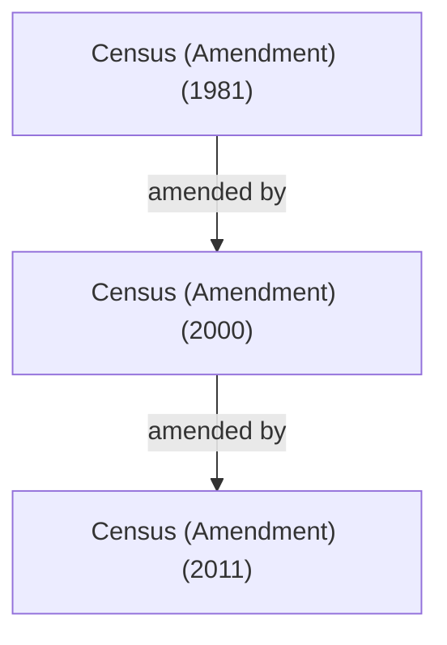

```mermaid
flowchart TD
    N1981["Census (Amendment) (1981)"]
    N2000["Census (Amendment) (2000)"]
    N2011["Census (Amendment) (2011)"]
    N1981 -->|amended by| N2000
    N2000 -->|amended by| N2011
    click N2011 "https://documents.gov.lk/view/acts/2011/5/26-2011_E.pdf" "Census 2011 PDF"
    click N2000 "https://documents.gov.lk/view/acts/2000/8/55-2000_E.pdf" "Census 2000 PDF"
    click N1981 "https://documents.gov.lk/view/acts/1981/3/16-1981_E.pdf" "Census 1981 PDF"
```