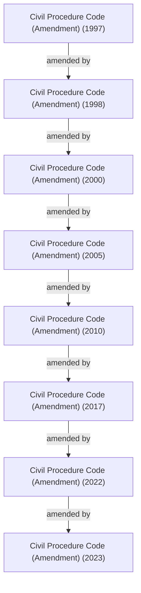

```mermaid
flowchart TD
    N1997["Civil Procedure Code (Amendment) (1997)"]
    N1998["Civil Procedure Code (Amendment) (1998)"]
    N2000["Civil Procedure Code (Amendment) (2000)"]
    N2005["Civil Procedure Code (Amendment) (2005)"]
    N2010["Civil Procedure Code (Amendment) (2010)"]
    N2017["Civil Procedure Code (Amendment) (2017)"]
    N2022["Civil Procedure Code (Amendment) (2022)"]
    N2023["Civil Procedure Code (Amendment) (2023)"]
    N1997 -->|amended by| N1998
    N1998 -->|amended by| N2000
    N2000 -->|amended by| N2005
    N2005 -->|amended by| N2010
    N2010 -->|amended by| N2017
    N2017 -->|amended by| N2022
    N2022 -->|amended by| N2023
    click N2023 "https://documents.gov.lk/view/acts/2023/6/07-2023_E.pdf" "Civil Procedure Code 2023 PDF"
    click N2022 "https://documents.gov.lk/view/acts/2022/2/05-2022_E.pdf" "Civil Procedure Code 2022 PDF"
    click N2017 "https://documents.gov.lk/view/acts/2017/6/08-2017_E.pdf" "Civil Procedure Code 2017 PDF"
    click N2010 "https://documents.gov.lk/view/acts/2010/10/11-2010_E.pdf" "Civil Procedure Code 2010 PDF"
    click N2005 "https://documents.gov.lk/view/acts/2005/2/04-2005_E.pdf" "Civil Procedure Code 2005 PDF"
    click N2000 "https://documents.gov.lk/view/acts/2000/7/34-2000_E.pdf" "Civil Procedure Code 2000 PDF"
    click N1998 "https://documents.gov.lk/view/acts/1998/6/38-1998_E.pdf" "Civil Procedure Code 1998 PDF"
    click N1997 "https://documents.gov.lk/view/acts/1997/7/14-1997_E.pdf" "Civil Procedure Code 1997 PDF"
```