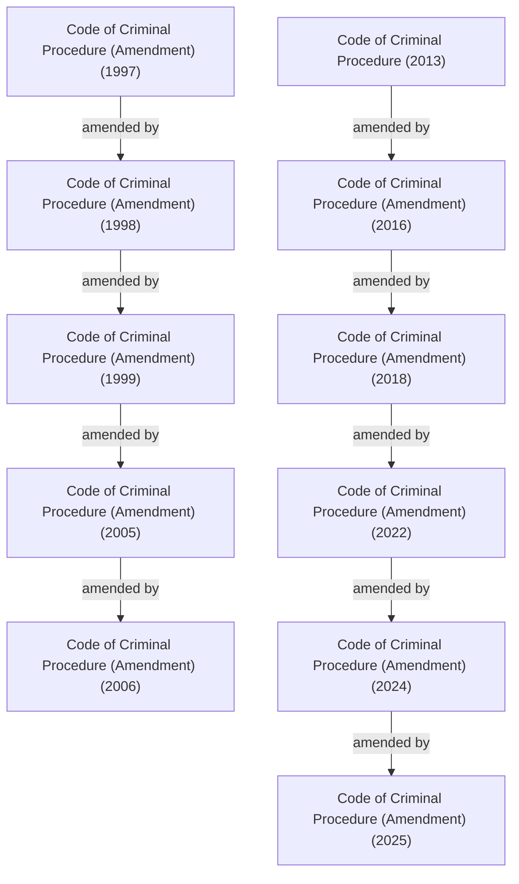

```mermaid
flowchart TD
    N1997["Code of Criminal Procedure (Amendment) (1997)"]
    N1998["Code of Criminal Procedure (Amendment) (1998)"]
    N1999["Code of Criminal Procedure (Amendment) (1999)"]
    N2005["Code of Criminal Procedure (Amendment) (2005)"]
    N2006["Code of Criminal Procedure (Amendment) (2006)"]
    N2013["Code of Criminal Procedure (2013)"]
    N2016["Code of Criminal Procedure (Amendment) (2016)"]
    N2018["Code of Criminal Procedure (Amendment) (2018)"]
    N2022["Code of Criminal Procedure (Amendment) (2022)"]
    N2024["Code of Criminal Procedure (Amendment) (2024)"]
    N2025["Code of Criminal Procedure (Amendment) (2025)"]
    N1997 -->|amended by| N1998
    N1998 -->|amended by| N1999
    N1999 -->|amended by| N2005
    N2005 -->|amended by| N2006
    N2013 -->|amended by| N2016
    N2016 -->|amended by| N2018
    N2018 -->|amended by| N2022
    N2022 -->|amended by| N2024
    N2024 -->|amended by| N2025
    click N2025 "https://documents.gov.lk/view/acts/2025/6/07-2025_E.pdf" "Code of Criminal Procedure 2025 PDF"
    click N2024 "https://documents.gov.lk/view/acts/2024/5/25-2024_E.pdf" "Code of Criminal Procedure 2024 PDF"
    click N2022 "https://documents.gov.lk/view/acts/2022/2/02-2022_E.pdf" "Code of Criminal Procedure 2022 PDF"
    click N2018 "https://documents.gov.lk/view/acts/2018/5/11-2018_E.pdf" "Code of Criminal Procedure 2018 PDF"
    click N2016 "https://documents.gov.lk/view/acts/2016/11/18-2016_E.pdf" "Code of Criminal Procedure 2016 PDF"
    click N2013 "https://documents.gov.lk/view/acts/2013/2/02-2013_E.pdf" "Code of Criminal Procedure 2013 PDF"
    click N2006 "https://documents.gov.lk/view/acts/2006/3/07-2006_E.pdf" "Code of Criminal Procedure 2006 PDF"
    click N2005 "https://documents.gov.lk/view/acts/2005/5/14-2005_E.pdf" "Code of Criminal Procedure 2005 PDF"
    click N1999 "https://documents.gov.lk/view/acts/1999/12/47-1999_E.pdf" "Code of Criminal Procedure 1999 PDF"
    click N1998 "https://documents.gov.lk/view/acts/1998/6/28-1998_E.pdf" "Code of Criminal Procedure 1998 PDF"
    click N1997 "https://documents.gov.lk/view/acts/1997/8/19-1997_E.pdf" "Code of Criminal Procedure 1997 PDF"
```