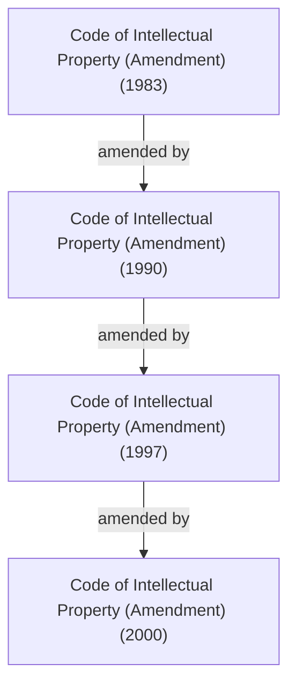

```mermaid
flowchart TD
    N1983["Code of Intellectual Property (Amendment) (1983)"]
    N1990["Code of Intellectual Property (Amendment) (1990)"]
    N1997["Code of Intellectual Property (Amendment) (1997)"]
    N2000["Code of Intellectual Property (Amendment) (2000)"]
    N1983 -->|amended by| N1990
    N1990 -->|amended by| N1997
    N1997 -->|amended by| N2000
    click N2000 "https://documents.gov.lk/view/acts/2000/8/40-2000_E.pdf" "Code of Intellectual Property 2000 PDF"
    click N1997 "https://documents.gov.lk/view/acts/1997/7/13-1997_E.pdf" "Code of Intellectual Property 1997 PDF"
    click N1990 "https://documents.gov.lk/view/acts/1990/4/17-1990_E.pdf" "Code of Intellectual Property 1990 PDF"
    click N1983 "https://documents.gov.lk/view/acts/1983/1/02-1983_E.pdf" "Code of Intellectual Property 1983 PDF"
```