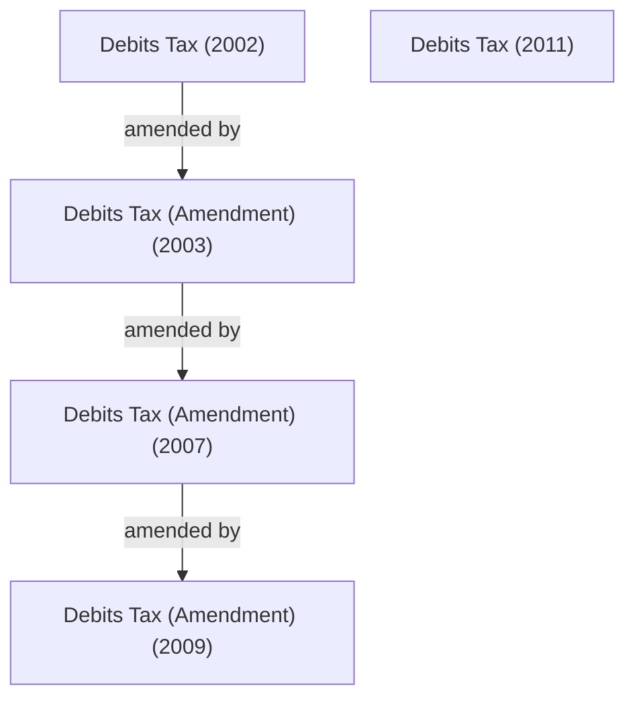

```mermaid
flowchart TD
    N2002["Debits Tax (2002)"]
    N2003["Debits Tax (Amendment) (2003)"]
    N2007["Debits Tax (Amendment) (2007)"]
    N2009["Debits Tax (Amendment) (2009)"]
    N2011["Debits Tax (2011)"]
    N2002 -->|amended by| N2003
    N2003 -->|amended by| N2007
    N2007 -->|amended by| N2009
    click N2011 "https://documents.gov.lk/view/acts/2011/3/14-2011_E.pdf" "Debits Tax 2011 PDF"
    click N2009 "https://documents.gov.lk/view/acts/2009/3/17-2009_E.pdf" "Debits Tax 2009 PDF"
    click N2007 "https://documents.gov.lk/view/acts/2007/4/12-2007_E.pdf" "Debits Tax 2007 PDF"
    click N2003 "https://documents.gov.lk/view/acts/2003/2/05-2003_E.pdf" "Debits Tax 2003 PDF"
    click N2002 "https://documents.gov.lk/view/acts/2002/8/16-2002_E.pdf" "Debits Tax 2002 PDF"
```