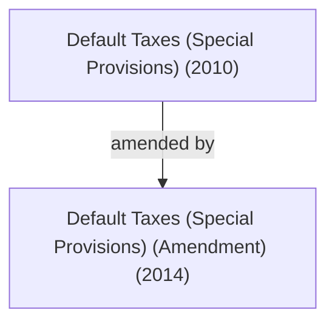

```mermaid
flowchart TD
    N2010["Default Taxes (Special Provisions) (2010)"]
    N2014["Default Taxes (Special Provisions) (Amendment) (2014)"]
    N2010 -->|amended by| N2014
    click N2014 "https://documents.gov.lk/view/acts/2014/4/14-2014_E.pdf" "Default Taxes (Special Provisions) 2014 PDF"
    click N2010 "https://documents.gov.lk/view/acts/2010/12/16-2010_E.pdf" "Default Taxes (Special Provisions) 2010 PDF"
```