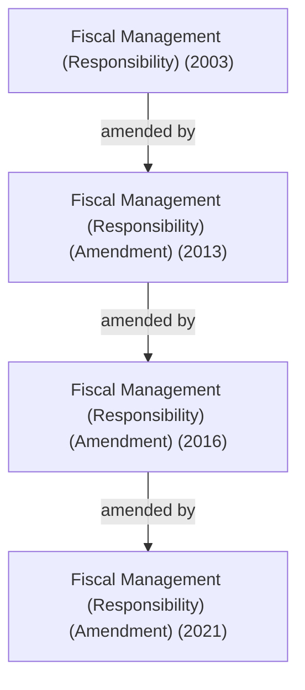

```mermaid
flowchart TD
    N2003["Fiscal Management (Responsibility) (2003)"]
    N2013["Fiscal Management (Responsibility) (Amendment) (2013)"]
    N2016["Fiscal Management (Responsibility) (Amendment) (2016)"]
    N2021["Fiscal Management (Responsibility) (Amendment) (2021)"]
    N2003 -->|amended by| N2013
    N2013 -->|amended by| N2016
    N2016 -->|amended by| N2021
    click N2021 "https://documents.gov.lk/view/acts/2021/6/12-2021_E.pdf" "Fiscal Management (Responsibility) 2021 PDF"
    click N2016 "https://documents.gov.lk/view/acts/2016/8/13-2016_E.pdf" "Fiscal Management (Responsibility) 2016 PDF"
    click N2013 "https://documents.gov.lk/view/acts/2013/4/15-2013_E.pdf" "Fiscal Management (Responsibility) 2013 PDF"
    click N2003 "https://documents.gov.lk/view/acts/2003/1/03-2003_E.pdf" "Fiscal Management (Responsibility) 2003 PDF"
```