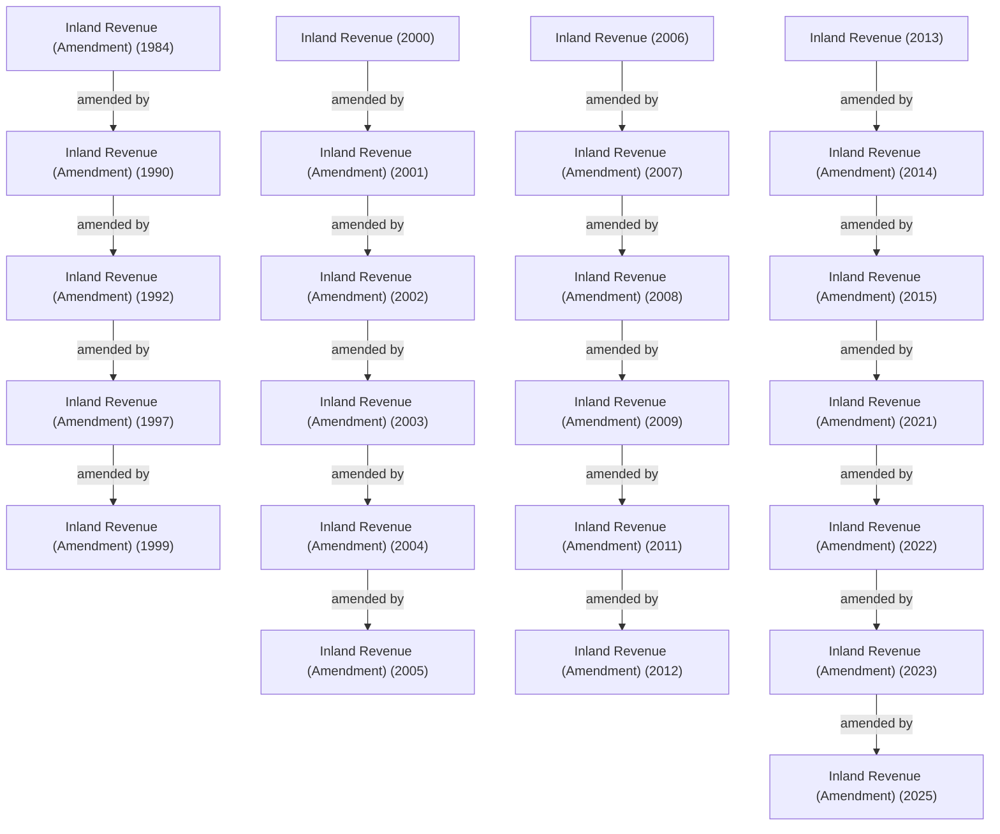

```mermaid
flowchart TD
    N1984["Inland Revenue (Amendment) (1984)"]
    N1990["Inland Revenue (Amendment) (1990)"]
    N1992["Inland Revenue (Amendment) (1992)"]
    N1997["Inland Revenue (Amendment) (1997)"]
    N1999["Inland Revenue (Amendment) (1999)"]
    N2000["Inland Revenue (2000)"]
    N2001["Inland Revenue (Amendment) (2001)"]
    N2002["Inland Revenue (Amendment) (2002)"]
    N2003["Inland Revenue (Amendment) (2003)"]
    N2004["Inland Revenue (Amendment) (2004)"]
    N2005["Inland Revenue (Amendment) (2005)"]
    N2006["Inland Revenue (2006)"]
    N2007["Inland Revenue (Amendment) (2007)"]
    N2008["Inland Revenue (Amendment) (2008)"]
    N2009["Inland Revenue (Amendment) (2009)"]
    N2011["Inland Revenue (Amendment) (2011)"]
    N2012["Inland Revenue (Amendment) (2012)"]
    N2013["Inland Revenue (2013)"]
    N2014["Inland Revenue (Amendment) (2014)"]
    N2015["Inland Revenue (Amendment) (2015)"]
    N2021["Inland Revenue (Amendment) (2021)"]
    N2022["Inland Revenue (Amendment) (2022)"]
    N2023["Inland Revenue (Amendment) (2023)"]
    N2025["Inland Revenue (Amendment) (2025)"]
    N1984 -->|amended by| N1990
    N1990 -->|amended by| N1992
    N1992 -->|amended by| N1997
    N1997 -->|amended by| N1999
    N2000 -->|amended by| N2001
    N2001 -->|amended by| N2002
    N2002 -->|amended by| N2003
    N2003 -->|amended by| N2004
    N2004 -->|amended by| N2005
    N2006 -->|amended by| N2007
    N2007 -->|amended by| N2008
    N2008 -->|amended by| N2009
    N2009 -->|amended by| N2011
    N2011 -->|amended by| N2012
    N2013 -->|amended by| N2014
    N2014 -->|amended by| N2015
    N2015 -->|amended by| N2021
    N2021 -->|amended by| N2022
    N2022 -->|amended by| N2023
    N2023 -->|amended by| N2025
    click N2025 "https://documents.gov.lk/view/acts/2025/3/02-2025_E.pdf" "Inland Revenue 2025 PDF"
    click N2023 "https://documents.gov.lk/view/acts/2023/5/04-2023_E.pdf" "Inland Revenue 2023 PDF"
    click N2022 "https://documents.gov.lk/view/acts/2022/12/45-2022_E.pdf" "Inland Revenue 2022 PDF"
    click N2021 "https://documents.gov.lk/view/acts/2021/5/10-2021_E.pdf" "Inland Revenue 2021 PDF"
    click N2015 "https://documents.gov.lk/view/acts/2015/10/09-2015_E.pdf" "Inland Revenue 2015 PDF"
    click N2014 "https://documents.gov.lk/view/acts/2014/4/08-2014_E.pdf" "Inland Revenue 2014 PDF"
    click N2013 "https://documents.gov.lk/view/acts/2013/4/18-2013_E.pdf" "Inland Revenue 2013 PDF"
    click N2012 "https://documents.gov.lk/view/acts/2012/3/08-2012_E.pdf" "Inland Revenue 2012 PDF"
    click N2011 "https://documents.gov.lk/view/acts/2011/3/22-2011_E.pdf" "Inland Revenue 2011 PDF"
    click N2009 "https://documents.gov.lk/view/acts/2009/3/19-2009_E.pdf" "Inland Revenue 2009 PDF"
    click N2008 "https://documents.gov.lk/view/acts/2008/2/09-2008_E.pdf" "Inland Revenue 2008 PDF"
    click N2007 "https://documents.gov.lk/view/acts/2007/3/10-2007_E.pdf" "Inland Revenue 2007 PDF"
    click N2006 "https://documents.gov.lk/view/acts/2006/3/10-2006_E.pdf" "Inland Revenue 2006 PDF"
    click N2005 "https://documents.gov.lk/view/acts/2005/3/08-2005_E.pdf" "Inland Revenue 2005 PDF"
    click N2004 "https://documents.gov.lk/view/acts/2004/11/12-2004_E.pdf" "Inland Revenue 2004 PDF"
    click N2003 "https://documents.gov.lk/view/acts/2003/5/19-2003_E.pdf" "Inland Revenue 2003 PDF"
    click N2002 "https://documents.gov.lk/view/acts/2002/6/10-2002_E.pdf" "Inland Revenue 2002 PDF"
    click N2001 "https://documents.gov.lk/view/acts/2001/7/08-2001_E.pdf" "Inland Revenue 2001 PDF"
    click N2000 "https://documents.gov.lk/view/acts/2000/8/38-2000_E.pdf" "Inland Revenue 2000 PDF"
    click N1999 "https://documents.gov.lk/view/acts/1999/11/41-1999_E.pdf" "Inland Revenue 1999 PDF"
    click N1997 "https://documents.gov.lk/view/acts/1997/9/24-1997_E.pdf" "Inland Revenue 1997 PDF"
    click N1992 "https://documents.gov.lk/view/acts/1992/11/63-1992_E.pdf" "Inland Revenue 1992 PDF"
    click N1990 "https://documents.gov.lk/view/acts/1990/6/22-1990_E.pdf" "Inland Revenue 1990 PDF"
    click N1984 "https://documents.gov.lk/view/acts/1984/4/14-1984_E.pdf" "Inland Revenue 1984 PDF"
```