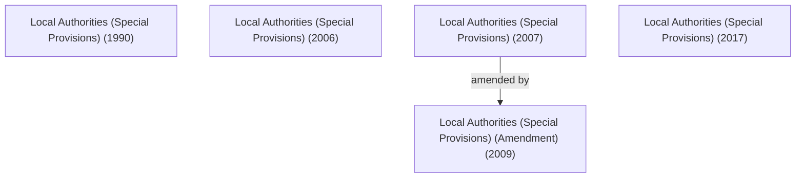

```mermaid
flowchart TD
    N1990["Local Authorities (Special Provisions) (1990)"]
    N2006["Local Authorities (Special Provisions) (2006)"]
    N2007["Local Authorities (Special Provisions) (2007)"]
    N2009["Local Authorities (Special Provisions) (Amendment) (2009)"]
    N2017["Local Authorities (Special Provisions) (2017)"]
    N2007 -->|amended by| N2009
    click N2017 "https://documents.gov.lk/view/acts/2017/11/28-2017_E.pdf" "Local Authorities (Special Provisions) 2017 PDF"
    click N2009 "https://documents.gov.lk/view/acts/2009/5/30-2009_E.pdf" "Local Authorities (Special Provisions) 2009 PDF"
    click N2007 "https://documents.gov.lk/view/acts/2007/8/30-2007_E.pdf" "Local Authorities (Special Provisions) 2007 PDF"
    click N2006 "https://documents.gov.lk/view/acts/2006/1/02-2006_E.pdf" "Local Authorities (Special Provisions) 2006 PDF"
    click N1990 "https://documents.gov.lk/view/acts/1990/6/24-1990_E.pdf" "Local Authorities (Special Provisions) 1990 PDF"
```