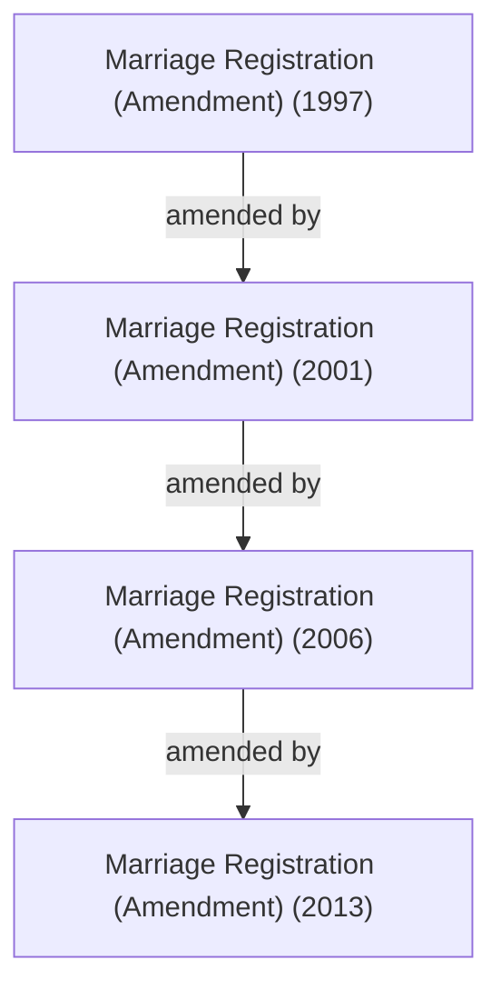

```mermaid
flowchart TD
    N1997["Marriage Registration (Amendment) (1997)"]
    N2001["Marriage Registration (Amendment) (2001)"]
    N2006["Marriage Registration (Amendment) (2006)"]
    N2013["Marriage Registration (Amendment) (2013)"]
    N1997 -->|amended by| N2001
    N2001 -->|amended by| N2006
    N2006 -->|amended by| N2013
    click N2013 "https://documents.gov.lk/view/acts/2013/5/22-2013_E.pdf" "Marriage Registration 2013 PDF"
    click N2006 "https://documents.gov.lk/view/acts/2006/11/36-2006_E.pdf" "Marriage Registration 2006 PDF"
    click N2001 "https://documents.gov.lk/view/acts/2001/9/11-2001_E.pdf" "Marriage Registration 2001 PDF"
    click N1997 "https://documents.gov.lk/view/acts/1997/7/12-1997_E.pdf" "Marriage Registration 1997 PDF"
```