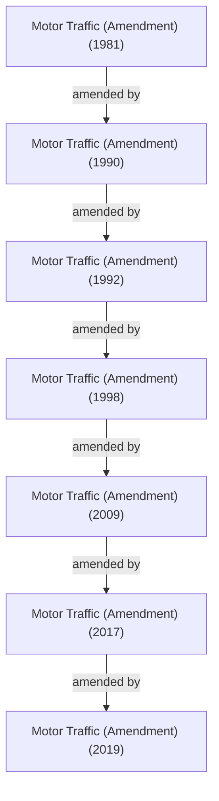

```mermaid
flowchart TD
    N1981["Motor Traffic (Amendment) (1981)"]
    N1990["Motor Traffic (Amendment) (1990)"]
    N1992["Motor Traffic (Amendment) (1992)"]
    N1998["Motor Traffic (Amendment) (1998)"]
    N2009["Motor Traffic (Amendment) (2009)"]
    N2017["Motor Traffic (Amendment) (2017)"]
    N2019["Motor Traffic (Amendment) (2019)"]
    N1981 -->|amended by| N1990
    N1990 -->|amended by| N1992
    N1992 -->|amended by| N1998
    N1998 -->|amended by| N2009
    N2009 -->|amended by| N2017
    N2017 -->|amended by| N2019
    click N2019 "https://documents.gov.lk/view/acts/2019/6/10-2019_E.pdf" "Motor Traffic 2019 PDF"
    click N2017 "https://documents.gov.lk/view/acts/2017/10/18-2017_E.pdf" "Motor Traffic 2017 PDF"
    click N2009 "https://documents.gov.lk/view/acts/2009/3/08-2009_E.pdf" "Motor Traffic 2009 PDF"
    click N1998 "https://documents.gov.lk/view/acts/1998/3/05-1998_E.pdf" "Motor Traffic 1998 PDF"
    click N1992 "https://documents.gov.lk/view/acts/1992/8/44-1992_E.pdf" "Motor Traffic 1992 PDF"
    click N1990 "https://documents.gov.lk/view/acts/1990/3/08-1990_E.pdf" "Motor Traffic 1990 PDF"
    click N1981 "https://documents.gov.lk/view/acts/1981/3/21-1981_E.pdf" "Motor Traffic 1981 PDF"
```