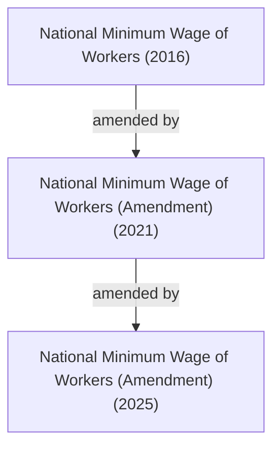

```mermaid
flowchart TD
    N2016["National Minimum Wage of Workers (2016)"]
    N2021["National Minimum Wage of Workers (Amendment) (2021)"]
    N2025["National Minimum Wage of Workers (Amendment) (2025)"]
    N2016 -->|amended by| N2021
    N2021 -->|amended by| N2025
    click N2025 "https://documents.gov.lk/view/acts/2025/7/11-2025_E.pdf" "National Minimum Wage of Workers 2025 PDF"
    click N2021 "https://documents.gov.lk/view/acts/2021/8/16-2021_E.pdf" "National Minimum Wage of Workers 2021 PDF"
    click N2016 "https://documents.gov.lk/view/acts/2016/3/03-2016_E.pdf" "National Minimum Wage of Workers 2016 PDF"
```