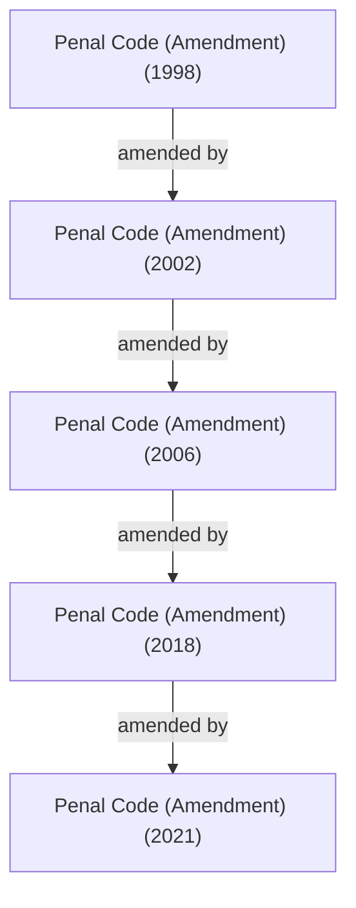

```mermaid
flowchart TD
    N1998["Penal Code (Amendment) (1998)"]
    N2002["Penal Code (Amendment) (2002)"]
    N2006["Penal Code (Amendment) (2006)"]
    N2018["Penal Code (Amendment) (2018)"]
    N2021["Penal Code (Amendment) (2021)"]
    N1998 -->|amended by| N2002
    N2002 -->|amended by| N2006
    N2006 -->|amended by| N2018
    N2018 -->|amended by| N2021
    click N2021 "https://documents.gov.lk/view/acts/2021/1/05-2021_E.pdf" "Penal Code 2021 PDF"
    click N2018 "https://documents.gov.lk/view/acts/2018/5/10-2018_E.pdf" "Penal Code 2018 PDF"
    click N2006 "https://documents.gov.lk/view/acts/2006/4/16-2006_E.pdf" "Penal Code 2006 PDF"
    click N2002 "https://documents.gov.lk/view/acts/2002/7/12-2002_E.pdf" "Penal Code 2002 PDF"
    click N1998 "https://documents.gov.lk/view/acts/1998/6/29-1998_E.pdf" "Penal Code 1998 PDF"
```