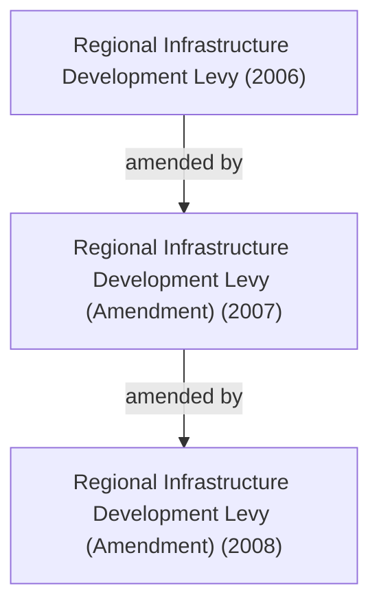

```mermaid
flowchart TD
    N2006["Regional Infrastructure Development Levy (2006)"]
    N2007["Regional Infrastructure Development Levy (Amendment) (2007)"]
    N2008["Regional Infrastructure Development Levy (Amendment) (2008)"]
    N2006 -->|amended by| N2007
    N2007 -->|amended by| N2008
    click N2008 "https://documents.gov.lk/view/acts/2008/2/12-2008_E.pdf" "Regional Infrastructure Development Levy 2008 PDF"
    click N2007 "https://documents.gov.lk/view/acts/2007/10/47-2007_E.pdf" "Regional Infrastructure Development Levy 2007 PDF"
    click N2006 "https://documents.gov.lk/view/acts/2006/12/51-2006_E.pdf" "Regional Infrastructure Development Levy 2006 PDF"
```