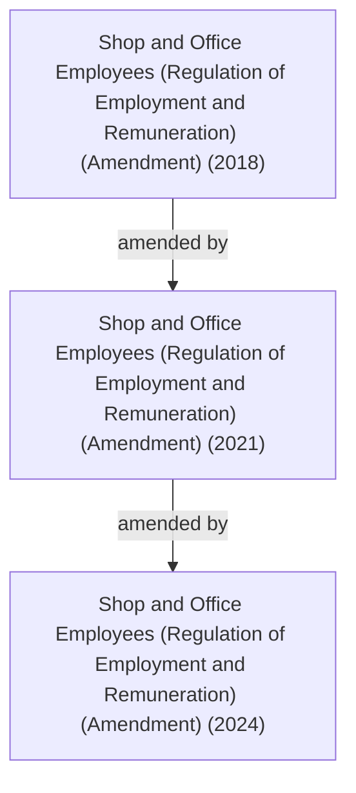

```mermaid
flowchart TD
    N2018["Shop and Office Employees (Regulation of Employment and Remuneration) (Amendment) (2018)"]
    N2021["Shop and Office Employees (Regulation of Employment and Remuneration) (Amendment) (2021)"]
    N2024["Shop and Office Employees (Regulation of Employment and Remuneration) (Amendment) (2024)"]
    N2018 -->|amended by| N2021
    N2021 -->|amended by| N2024
    click N2024 "https://documents.gov.lk/view/acts/2024/5/28-2024_E.pdf" "Shop and Office Employees (Regulation of Employment and Remuneration) 2024 PDF"
    click N2021 "https://documents.gov.lk/view/acts/2021/1/01-2021_E.pdf" "Shop and Office Employees (Regulation of Employment and Remuneration) 2021 PDF"
    click N2018 "https://documents.gov.lk/view/acts/2018/6/14-2018_E.pdf" "Shop and Office Employees (Regulation of Employment and Remuneration) 2018 PDF"
```