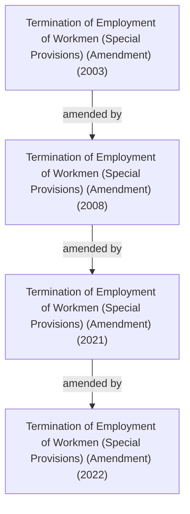

```mermaid
flowchart TD
    N2003["Termination of Employment of Workmen (Special Provisions) (Amendment) (2003)"]
    N2008["Termination of Employment of Workmen (Special Provisions) (Amendment) (2008)"]
    N2021["Termination of Employment of Workmen (Special Provisions) (Amendment) (2021)"]
    N2022["Termination of Employment of Workmen (Special Provisions) (Amendment) (2022)"]
    N2003 -->|amended by| N2008
    N2008 -->|amended by| N2021
    N2021 -->|amended by| N2022
    click N2022 "https://documents.gov.lk/view/acts/2022/9/23-2022_E.pdf" "Termination of Employment of Workmen (Special Provisions) 2022 PDF"
    click N2021 "https://documents.gov.lk/view/acts/2021/11/29-2021_E.pdf" "Termination of Employment of Workmen (Special Provisions) 2021 PDF"
    click N2008 "https://documents.gov.lk/view/acts/2008/3/20-2008_E.pdf" "Termination of Employment of Workmen (Special Provisions) 2008 PDF"
    click N2003 "https://documents.gov.lk/view/acts/2003/3/12-2003_E.pdf" "Termination of Employment of Workmen (Special Provisions) 2003 PDF"
```