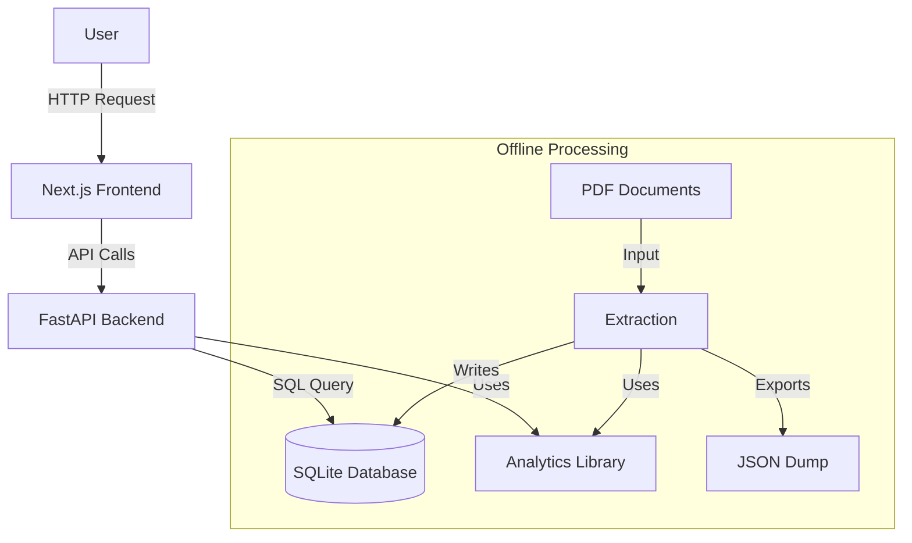

# System Architecture

The Legislative Analysis tool is designed as a modern, decoupled web application that leverages GenAI for backend data processing.

## High-Level Overview

The system consists of three main layers:
1.  **Data Ingestion & Processing Layer**: Python scripts using Google Gemini to analyze PDFs.
2.  **Service Layer**: A FastAPI backend that serves the structured data.
3.  **Presentation Layer**: A Next.js frontend that provides an interactive UI.

## Component Details

### 1. Offline Processing (The "Brain")
*   **Input**: Raw PDF files of Sri Lankan Acts.
*   **Engine**: `scripts/update_docs_data.py` and `ldf/` modules.
*   **AI Model**: Google Gemini 2.0 Flash (via `google.genai`).
*   **Output**: Structured JSON data and a populated SQLite database.
*   **Role**: This layer runs asynchronously to the web app. It pre-computes the analysis so the web app is fast and responsive.

### 2. Backend API
*   **Framework**: FastAPI.
*   **Responsibility**:
    *   Exposes endpoints for listing acts, searching, and retrieving detailed metadata.
    *   Handlers complex queries that might be too heavy for the client-side.
    *   Manages database connections via `SQLModel`.

### 3. Frontend UI
*   **Framework**: Next.js (React).
*   **Styling**: Tailwind CSS + Shadcn UI.
*   **Responsibility**:
    *   Renders the interactive dashboard.
    *   Displays Acts in a responsive Card Grid.
    *   Visualizes relationships between acts (amendments, references).

## Data Flow

1.  **Ingestion**: A new PDF is placed in the `data/` folder.
2.  **Analysis**: The extraction script reads the PDF, sends text to Gemini, and receives a structured JSON response.
3.  **Storage**: The JSON is parsed and stored in `research.db` tables (`Act`, `Amendment`, `Entity`).
4.  **Serving**: When a user visits the web app, the Backend fetches this structured data and sends it to the Frontend for display.
