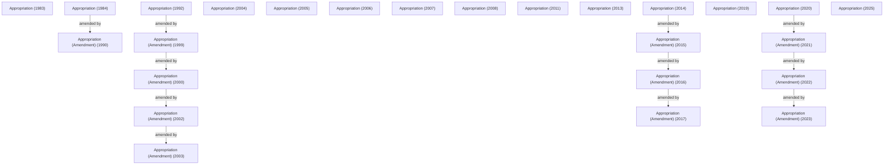

```mermaid
flowchart TD
    N1983["Appropriation (1983)"]
    N1984["Appropriation (1984)"]
    N1990["Appropriation (Amendment) (1990)"]
    N1992["Appropriation (1992)"]
    N1999["Appropriation (Amendment) (1999)"]
    N2000["Appropriation (Amendment) (2000)"]
    N2002["Appropriation (Amendment) (2002)"]
    N2003["Appropriation (Amendment) (2003)"]
    N2004["Appropriation (2004)"]
    N2005["Appropriation (2005)"]
    N2006["Appropriation (2006)"]
    N2007["Appropriation (2007)"]
    N2008["Appropriation (2008)"]
    N2011["Appropriation (2011)"]
    N2013["Appropriation (2013)"]
    N2014["Appropriation (2014)"]
    N2015["Appropriation (Amendment) (2015)"]
    N2016["Appropriation (Amendment) (2016)"]
    N2017["Appropriation (Amendment) (2017)"]
    N2019["Appropriation (2019)"]
    N2020["Appropriation (2020)"]
    N2021["Appropriation (Amendment) (2021)"]
    N2022["Appropriation (Amendment) (2022)"]
    N2023["Appropriation (Amendment) (2023)"]
    N2025["Appropriation (2025)"]
    N1984 -->|amended by| N1990
    N1992 -->|amended by| N1999
    N1999 -->|amended by| N2000
    N2000 -->|amended by| N2002
    N2002 -->|amended by| N2003
    N2014 -->|amended by| N2015
    N2015 -->|amended by| N2016
    N2016 -->|amended by| N2017
    N2020 -->|amended by| N2021
    N2021 -->|amended by| N2022
    N2022 -->|amended by| N2023
    click N2025 "https://documents.gov.lk/view/acts/2025/3/03-2025_E.pdf" "Appropriation 2025 PDF"
    click N2023 "https://documents.gov.lk/view/acts/2023/8/12-2023_E.pdf" "Appropriation 2023 PDF"
    click N2022 "https://documents.gov.lk/view/acts/2022/9/21-2022_E.pdf" "Appropriation 2022 PDF"
    click N2021 "https://documents.gov.lk/view/acts/2021/11/26-2021_E.pdf" "Appropriation 2021 PDF"
    click N2020 "https://documents.gov.lk/view/acts/2020/11/06-2020_E.pdf" "Appropriation 2020 PDF"
    click N2019 "https://documents.gov.lk/view/acts/2019/4/06-2019_E.pdf" "Appropriation 2019 PDF"
    click N2017 "https://documents.gov.lk/view/acts/2017/12/32-2017_E.pdf" "Appropriation 2017 PDF"
    click N2016 "https://documents.gov.lk/view/acts/2016/11/23-2016_E.pdf" "Appropriation 2016 PDF"
    click N2015 "https://documents.gov.lk/view/acts/2015/2/01-2015_E.pdf" "Appropriation 2015 PDF"
    click N2014 "https://documents.gov.lk/view/acts/2014/11/41-2014_E.pdf" "Appropriation 2014 PDF"
    click N2013 "https://documents.gov.lk/view/acts/2013/12/36-2013_E.pdf" "Appropriation 2013 PDF"
    click N2011 "https://documents.gov.lk/view/acts/2011/12/52-2011_E.pdf" "Appropriation 2011 PDF"
    click N2008 "https://documents.gov.lk/view/acts/2008/12/43-2008_E.pdf" "Appropriation 2008 PDF"
    click N2007 "https://documents.gov.lk/view/acts/2007/12/61-2007_E.pdf" "Appropriation 2007 PDF"
    click N2006 "https://documents.gov.lk/view/acts/2006/12/47-2006_E.pdf" "Appropriation 2006 PDF"
    click N2005 "https://documents.gov.lk/view/acts/2005/12/39-2005_E.pdf" "Appropriation 2005 PDF"
    click N2004 "https://documents.gov.lk/view/acts/2004/12/15-2004_E.pdf" "Appropriation 2004 PDF"
    click N2003 "https://documents.gov.lk/view/acts/2003/12/43-2003_E.pdf" "Appropriation 2003 PDF"
    click N2002 "https://documents.gov.lk/view/acts/2002/12/29-2002_E.pdf" "Appropriation 2002 PDF"
    click N2000 "https://documents.gov.lk/view/acts/2000/7/32-2000_E.pdf" "Appropriation 2000 PDF"
    click N1999 "https://documents.gov.lk/view/acts/1999/12/49-1999_E.pdf" "Appropriation 1999 PDF"
    click N1992 "https://documents.gov.lk/view/acts/1992/12/67-1992_E.pdf" "Appropriation 1992 PDF"
    click N1990 "https://documents.gov.lk/view/acts/1990/8/31-1990_E.pdf" "Appropriation 1990 PDF"
    click N1984 "https://documents.gov.lk/view/acts/1984/12/46-1984_E.pdf" "Appropriation 1984 PDF"
    click N1983 "https://documents.gov.lk/view/acts/1983/12/52-1983_E.pdf" "Appropriation 1983 PDF"
```