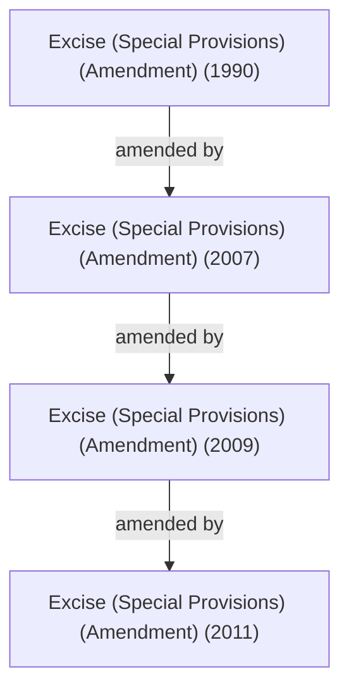

```mermaid
flowchart TD
    N1990["Excise (Special Provisions) (Amendment) (1990)"]
    N2007["Excise (Special Provisions) (Amendment) (2007)"]
    N2009["Excise (Special Provisions) (Amendment) (2009)"]
    N2011["Excise (Special Provisions) (Amendment) (2011)"]
    N1990 -->|amended by| N2007
    N2007 -->|amended by| N2009
    N2009 -->|amended by| N2011
    click N2011 "https://documents.gov.lk/view/acts/2011/3/17-2011_E.pdf" "Excise (Special Provisions) 2011 PDF"
    click N2009 "https://documents.gov.lk/view/acts/2009/3/14-2009_E.pdf" "Excise (Special Provisions) 2009 PDF"
    click N2007 "https://documents.gov.lk/view/acts/2007/10/46-2007_E.pdf" "Excise (Special Provisions) 2007 PDF"
    click N1990 "https://documents.gov.lk/view/acts/1990/11/40-1990_E.pdf" "Excise (Special Provisions) 1990 PDF"
```