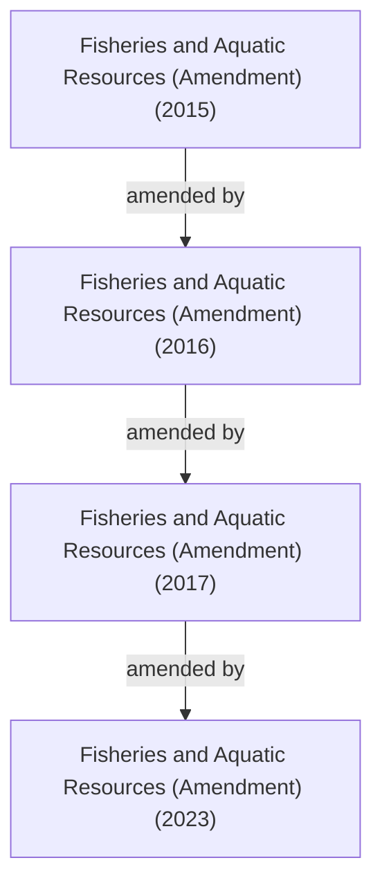

```mermaid
flowchart TD
    N2015["Fisheries and Aquatic Resources (Amendment) (2015)"]
    N2016["Fisheries and Aquatic Resources (Amendment) (2016)"]
    N2017["Fisheries and Aquatic Resources (Amendment) (2017)"]
    N2023["Fisheries and Aquatic Resources (Amendment) (2023)"]
    N2015 -->|amended by| N2016
    N2016 -->|amended by| N2017
    N2017 -->|amended by| N2023
    click N2023 "https://documents.gov.lk/view/acts/2023/11/27-2023_E.pdf" "Fisheries and Aquatic Resources 2023 PDF"
    click N2017 "https://documents.gov.lk/view/acts/2017/7/11-2017_E.pdf" "Fisheries and Aquatic Resources 2017 PDF"
    click N2016 "https://documents.gov.lk/view/acts/2016/2/02-2016_E.pdf" "Fisheries and Aquatic Resources 2016 PDF"
    click N2015 "https://documents.gov.lk/view/acts/2015/3/02-2015_E.pdf" "Fisheries and Aquatic Resources 2015 PDF"
```