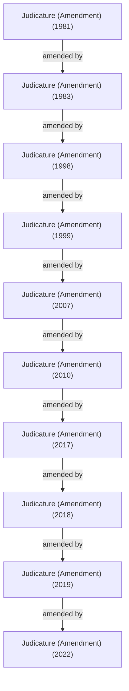

```mermaid
flowchart TD
    N1981["Judicature (Amendment) (1981)"]
    N1983["Judicature (Amendment) (1983)"]
    N1998["Judicature (Amendment) (1998)"]
    N1999["Judicature (Amendment) (1999)"]
    N2007["Judicature (Amendment) (2007)"]
    N2010["Judicature (Amendment) (2010)"]
    N2017["Judicature (Amendment) (2017)"]
    N2018["Judicature (Amendment) (2018)"]
    N2019["Judicature (Amendment) (2019)"]
    N2022["Judicature (Amendment) (2022)"]
    N1981 -->|amended by| N1983
    N1983 -->|amended by| N1998
    N1998 -->|amended by| N1999
    N1999 -->|amended by| N2007
    N2007 -->|amended by| N2010
    N2010 -->|amended by| N2017
    N2017 -->|amended by| N2018
    N2018 -->|amended by| N2019
    N2019 -->|amended by| N2022
    click N2022 "https://documents.gov.lk/view/acts/2022/2/04-2022_E.pdf" "Judicature 2022 PDF"
    click N2019 "https://documents.gov.lk/view/acts/2019/4/05-2019_E.pdf" "Judicature 2019 PDF"
    click N2018 "https://documents.gov.lk/view/acts/2018/5/09-2018_E.pdf" "Judicature 2018 PDF"
    click N2017 "https://documents.gov.lk/view/acts/2017/11/26-2017_E.pdf" "Judicature 2017 PDF"
    click N2010 "https://documents.gov.lk/view/acts/2010/8/10-2010_E.pdf" "Judicature 2010 PDF"
    click N2007 "https://documents.gov.lk/view/acts/2007/8/31-2007_E.pdf" "Judicature 2007 PDF"
    click N1999 "https://documents.gov.lk/view/acts/1999/8/27-1999_E.pdf" "Judicature 1999 PDF"
    click N1998 "https://documents.gov.lk/view/acts/1998/6/27-1998_E.pdf" "Judicature 1998 PDF"
    click N1983 "https://documents.gov.lk/view/acts/1983/10/36-1983_E.pdf" "Judicature 1983 PDF"
    click N1981 "https://documents.gov.lk/view/acts/1981/11/71-1981_E.pdf" "Judicature 1981 PDF"
```