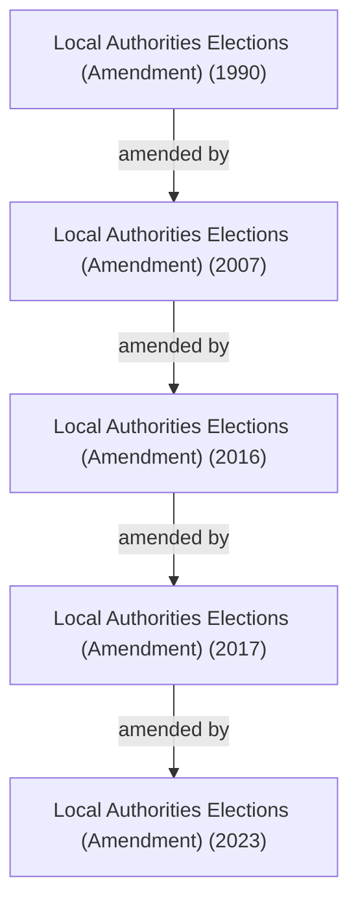

```mermaid
flowchart TD
    N1990["Local Authorities Elections (Amendment) (1990)"]
    N2007["Local Authorities Elections (Amendment) (2007)"]
    N2016["Local Authorities Elections (Amendment) (2016)"]
    N2017["Local Authorities Elections (Amendment) (2017)"]
    N2023["Local Authorities Elections (Amendment) (2023)"]
    N1990 -->|amended by| N2007
    N2007 -->|amended by| N2016
    N2016 -->|amended by| N2017
    N2017 -->|amended by| N2023
    click N2023 "https://documents.gov.lk/view/acts/2023/11/30-2023_E.pdf" "Local Authorities Elections 2023 PDF"
    click N2017 "https://documents.gov.lk/view/acts/2017/8/16-2017_E.pdf" "Local Authorities Elections 2017 PDF"
    click N2016 "https://documents.gov.lk/view/acts/2016/2/01-2016_E.pdf" "Local Authorities Elections 2016 PDF"
    click N2007 "https://documents.gov.lk/view/acts/2007/4/16-2007_E.pdf" "Local Authorities Elections 2007 PDF"
    click N1990 "https://documents.gov.lk/view/acts/1990/6/25-1990_E.pdf" "Local Authorities Elections 1990 PDF"
```