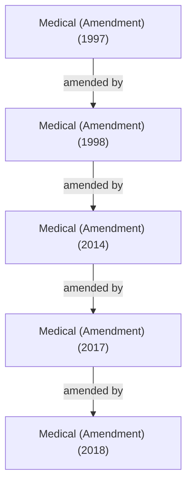

```mermaid
flowchart TD
    N1997["Medical (Amendment) (1997)"]
    N1998["Medical (Amendment) (1998)"]
    N2014["Medical (Amendment) (2014)"]
    N2017["Medical (Amendment) (2017)"]
    N2018["Medical (Amendment) (2018)"]
    N1997 -->|amended by| N1998
    N1998 -->|amended by| N2014
    N2014 -->|amended by| N2017
    N2017 -->|amended by| N2018
    click N2018 "https://documents.gov.lk/view/acts/2018/9/28-2018_E.pdf" "Medical 2018 PDF"
    click N2017 "https://documents.gov.lk/view/acts/2017/2/01-2017_E.pdf" "Medical 2017 PDF"
    click N2014 "https://documents.gov.lk/view/acts/2014/4/06-2014_E.pdf" "Medical 2014 PDF"
    click N1998 "https://documents.gov.lk/view/acts/1998/6/40-1998_E.pdf" "Medical 1998 PDF"
    click N1997 "https://documents.gov.lk/view/acts/1997/12/33-1997_E.pdf" "Medical 1997 PDF"
```