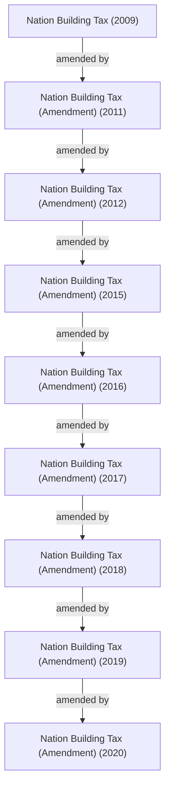

```mermaid
flowchart TD
    N2009["Nation Building Tax (2009)"]
    N2011["Nation Building Tax (Amendment) (2011)"]
    N2012["Nation Building Tax (Amendment) (2012)"]
    N2015["Nation Building Tax (Amendment) (2015)"]
    N2016["Nation Building Tax (Amendment) (2016)"]
    N2017["Nation Building Tax (Amendment) (2017)"]
    N2018["Nation Building Tax (Amendment) (2018)"]
    N2019["Nation Building Tax (Amendment) (2019)"]
    N2020["Nation Building Tax (Amendment) (2020)"]
    N2009 -->|amended by| N2011
    N2011 -->|amended by| N2012
    N2012 -->|amended by| N2015
    N2015 -->|amended by| N2016
    N2016 -->|amended by| N2017
    N2017 -->|amended by| N2018
    N2018 -->|amended by| N2019
    N2019 -->|amended by| N2020
    click N2020 "https://documents.gov.lk/view/acts/2020/10/03-2020_E.pdf" "Nation Building Tax 2020 PDF"
    click N2019 "https://documents.gov.lk/view/acts/2019/10/20-2019_E.pdf" "Nation Building Tax 2019 PDF"
    click N2018 "https://documents.gov.lk/view/acts/2018/7/20-2018_E.pdf" "Nation Building Tax 2018 PDF"
    click N2017 "https://documents.gov.lk/view/acts/2017/8/13-2017_E.pdf" "Nation Building Tax 2017 PDF"
    click N2016 "https://documents.gov.lk/view/acts/2016/11/22-2016_E.pdf" "Nation Building Tax 2016 PDF"
    click N2015 "https://documents.gov.lk/view/acts/2015/10/12-2015_E.pdf" "Nation Building Tax 2015 PDF"
    click N2012 "https://documents.gov.lk/view/acts/2012/3/09-2012_E.pdf" "Nation Building Tax 2012 PDF"
    click N2011 "https://documents.gov.lk/view/acts/2011/3/10-2011_E.pdf" "Nation Building Tax 2011 PDF"
    click N2009 "https://documents.gov.lk/view/acts/2009/3/09-2009_E.pdf" "Nation Building Tax 2009 PDF"
```